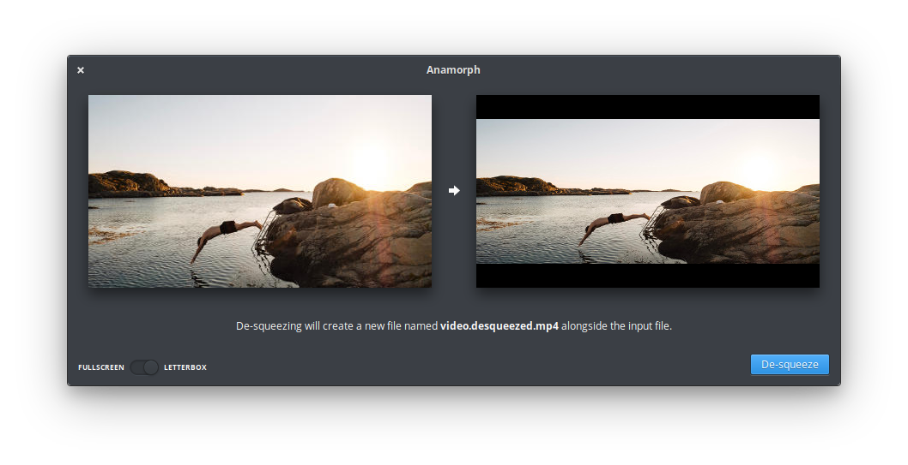

[](https://travis-ci.com/cassidyjames/anamorph)

<p align="center">
  
</p>
<h1 align="center">Anamorph</h1>
<!--p align="center">
  <a href="https://appcenter.elementary.io/com.github.cassidyjames.anamorph"></a>
</p-->



## De-squeeze anamorphic footage

Get that cinematic look from your video without opening a heavyweight editor. Anamorph de-squeezes anamorphic video shot with an anamorphic lens on a 16:9 sensor, like the one in your smartphone. Perfect for the Moment Anamorphic lens or other lenses designed for Pixel, Galaxy, iPhone, etc.

Currently supports 1.33× anamorphic, like the [Moment] Anamorphic lens.

## Get Moment Lenses

Looking for an awesome anamorphic lens to use with Anamorph? Grab one from [Moment] using my [referral link][Moment] to support me! A small portion of each purchase is shared with me.

[Shop Moment][Moment]

## Made for [elementary OS]

Anamorph is designed and developed on and for [elementary OS]. <!--Purchasing through AppCenter directly supports the development and ensures instant updates straight from me. [Get it on AppCenter][AppCenter] for the best experience.

[][AppCenter]

Versions of Anamorph may have been built and made available elsewhere by third-parties. These builds may have modifications or changes and **are not provided nor supported by me**. The only supported version is distributed via [AppCenter] on elementary OS.

-->

## Developing and Building

Development is targeted at elementary OS Juno. If you want to hack on and build Anamorph yourself, you'll need the following dependencies:

* libgranite-dev
* libgtk-3-dev
* meson
* valac

You can install them on elementary OS Juno with:

```shell
sudo apt install elementary-sdk
```

Run `meson build` to configure the build environment and run `ninja` to build:

```shell
meson build --prefix=/usr
cd build
ninja
```

To install, use `ninja install`, then execute with `com.github.cassidyjames.anamorph`:

```shell
sudo ninja install
com.github.cassidyjames.anamorph
```

## Test Footage

An album of un-de-squeezed (so… squeezed?) footage taken with the Moment Anamorphic lens is available [here](https://photos.app.goo.gl/nAtJjwVDEEQxRb1DA) for testing.

## Special Thanks

- [Micah Ilbery](https://github.com/micahilbery) for the incredible icons
- [David Hewitt](https://github.com/davidmhewitt) for GStreamer work
- [Moment] for the awesome lens and inspiration!

[Moment]: https://www.shopmoment.com/shop?tap_a=30146-d3ce98&tap_s=363496-01e37a&utm_medium=referral&utm_source=ambassador&utm_campaign=Moment%2BReferral%2BProgram&utm_content=cassidyblaede
[elementary OS]: https://elementary.io
[AppCenter]: https://appcenter.elementary.io/com.github.cassidyjames.anamorph
