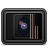

# Anamorph

## De-squeeze anamorphic footage.

Get that cinematic look from your video without opening a heavyweight editor. Anamorph de-squeezes anamorphic video shot with an anamorphic lens on a 16:9 sensor, like the one in your smartphone. Perfect for the Moment Anamorphic lens or other lenses designed for Pixel, Galaxy, and iPhone.

## 10% off Moment Lenses

Looking for an awesome anamorphic lens to use with Anamorph? Grab one from [Moment][1] and get 10% off your first order using our [referral link][1].

[Shop Moment][1]

## Special Thanks

- [Micah Ilbery](https://github.com/micahilbery) for the incredible icons
- [David Hewitt](https://github.com/davidmhewitt) for GStreamer work
- [Moment][1] for the awesome lens and inspiration!

[1]: https://www.shopmoment.com/shop?tap_a=30146-d3ce98&tap_s=363496-01e37a&utm_medium=referral&utm_source=ambassador&utm_campaign=Moment%2BReferral%2BProgram&utm_content=cassidyblaede
